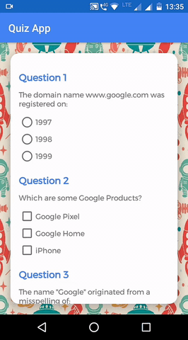

# Quiz-App
Android Basics by Google Nanodegree Program -  Udacity

## Project Overview
The Quiz App project combines everything learned in "User Input" section of the Nanodegree program. It is an educational app that quizzes a user about a history of Google. 

This project is about combining various ideas and skills practiced throughout the course. They include: 
- Planning the app design before coding.
- Taking an app layout from drawing to XML code.
- Creating, positioning, and styling views.
- Creating interactivity through button clicks and Java code.
- Commenting and documenting your code.

## Demo

